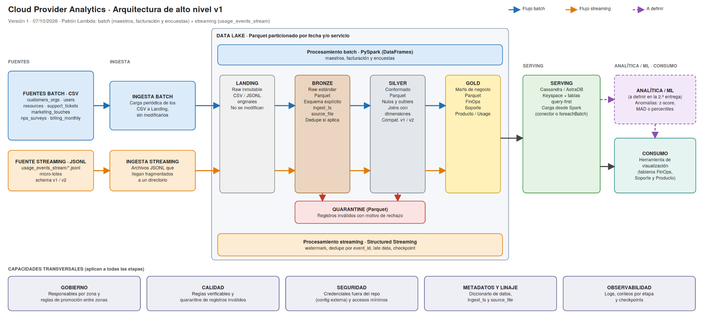
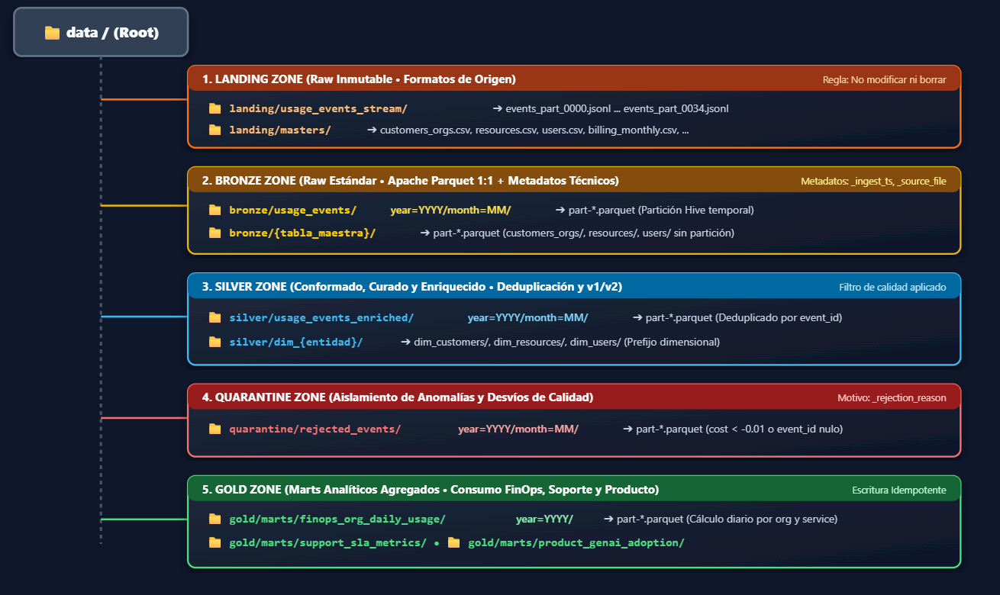
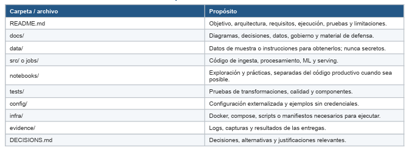

**INSTITUTO SUPERIOR TECNOLÓGICO EMPRESARIAL ARGENTINO (ISTEA)**
MINERÍA DE DATOS II - 2C 2026
Proyecto Integrador Obligatorio: Cloud Provider Analytics

# Documento de diseño arquitectónico y fundación de datos

## Interpretación del problema, usuarios y objetivos medibles

**Contexto del Negocio:** La empresa opera como un proveedor global de servicios de infraestructura en la nube (Cloud Provider). El problema con el que nos encontramos es: la información operativa, financiera y de soporte se encuentra fragmentada en silos tecnológicos aislados (bases CRM relacionales, sistemas de facturación mensual y telemetría de eventos de uso de recursos). Esta desconexión impide consolidar una visión unificada del cliente, imposibilita el análisis de rentabilidad por servicio y dificulta la prevención de cancelaciones de cuenta.

El proyecto propone construir un flujo de datos de punta a punta: ingestar las fuentes (batch para CRM, facturación y referencias; streaming para los eventos de uso), limpiarlas y unificarlas en capas (Bronze, Silver y Gold), y publicar los resultados en Cassandra/AstraDB para que se puedan consultar rápido.

### Usuarios y preguntas principales

| **Dominio** | **Usuario** | **Pregunta Principal de Negocio** |
| --- | --- | --- |
| FinOps | Director de Finanzas & Controller | ¿Cuál es el costo diario por organización y servicio en USD, y qué desvíos o anomalías existen? |
| Soporte | Head of Customer Support | ¿Cuál es la tasa de cumplimiento de SLA y la satisfacción (CSAT) promedio por región? |
| Producto | VP de Infraestructura & Cloud | ¿Cómo evoluciona el consumo de capacidades críticas (Compute, DB, GenAI tokens, Carbon Footprint)? |

### Objetivos medibles del proyecto

- **Calidad de datos en ingesta:** el 100 % de los registros que incumplen las reglas de calidad se desvía a Quarantine con su motivo de rechazo, sin detener el pipeline, y el porcentaje de rechazos se reporta en cada corrida.
- **Latencia de Serving:** las consultas sobre Cassandra/AstraDB responden en menos de 100 ms cuando se filtran por clave de partición.
- **Evolución de esquemas:** el 100 % de los eventos V1 y V2 se leen sin errores, y carbon_kg y genai_tokens existen en el esquema de Silver (nulos para los eventos V1).

## Justificación de la necesidad de Big Data mediante las 5V

La adopción de una arquitectura de Big Data basada en el ecosistema Apache (Spark, Parquet, Cassandra) está estrictamente fundamentada en las características intrínsecas de la telemetría del proveedor de nube:

| **Dimensión (V)** | **Manifiesto en el Proyecto** | **Impacto Técnico y Decisión** |
| --- | --- | --- |
| Volumen | Gran cantidad de eventos diarios de telemetría de uso emitidos por máquinas virtuales, bases de datos y servicios de GenAI (archivos .jsonl streaming) combinados con archivos maestros históricos. | Imposibilidad de procesamiento RDBMS tradicional. Requiere almacenamiento distribuido en Parquet y procesamiento paralelo distribuido en PySpark. |
| Velocidad | Ráfagas continuas de eventos de consumo que requieren visibilidad continua para alertas de consumo atípico y control de límites de crédito en FinOps. | Necesidad de un motor de procesamiento de flujos (PySpark Structured Streaming) con arquitectura de micro-lotes y ventanas de tiempo. |
| Variedad | Coexistencia de fuentes altamente estructuradas (CSVs de clientes, facturación y tickets), semiestructuradas (JSON de métricas de recursos) y flujos JSONL con evolución de esquema. | Data Lake multi-capa capaz de asimilar esquemas heterogéneos y unificarlos en formatos de almacenamiento columnar optimizados. |
| Veracidad | Presencia de inconsistencias de datos de origen: facturas con subtotales negativos (notas de crédito que requieren criterio), tickets abiertos con puntaje CSAT asignado, NPS con valores descalibrados (>100). | Implementación de reglas de calidad automatizadas en el pipeline, aislamiento en Quarantine y linaje transparente. |
| Valor | Consolidación de la rentabilidad real por cliente (Net Revenue Retention - NRR), correlación entre fallas técnicas y churn de cuentas, e impacto ambiental (carbon footprint). | Poblado automático de tablas de Serving en Cassandra diseñadas query-first para dashboards ejecutivos e informes operativos. |

## Inventario y perfil inicial de las fuentes de datos

El sistema consolida 8 fuentes de datos heterogéneas. A continuación se detalla su caracterización técnica y perfil de calidad:

| **Fuente** | **Grano** | **Frecuencia** | **Campos Clave / Trazabilidad** | **Desafíos de Calidad y Riesgos** |
| --- | --- | --- | --- | --- |
| customers_orgs.csv | 1 reg x Organización | Mensual / Batch | org_id (PK), industry, region, plan, nps_score | Puntajes NPS atípicos (ej. > 100) y nulos. Datos PII que requieren enmascaramiento. |
| users.csv | 1 reg x Usuario | Diario / Batch | user_id (PK), org_id (FK), role, created_at | Usuarios vinculados a orgs eliminadas (integridad referencial). |
| resources.csv | 1 reg x Recurso | Batch / Evento | resource_id (PK), org_id (FK), resource_type, region | Estructuras JSON anidadas en tags que requieren aplanamiento. |
| support_tickets.csv | 1 reg x Ticket | Diario / Batch | ticket_id (PK), org_id (FK), severity, csat, resolved_at | 172 tickets abiertos con CSAT asignado y valores de CSAT fuera de rango (0, 6, 7). |
| marketing_touches.csv | 1 reg x Interacción | Diario / Batch | touch_id (PK), org_id (FK), channel, touch_date | Atribución de canales duplicada o fechas inconsistentes. |
| nps_surveys.csv | 1 reg x Encuesta | Mensual / Batch | survey_id (PK), org_id (FK), survey_date, nps_score | Alta proporción de valores nulos y comentarios cualitativos sin estructurar. |
| billing_monthly.csv | 1 reg x Factura/Mes | Mensual / Batch | invoice_id (PK), org_id (FK), subtotal, currency, rate | Subtotales negativos (notas de crédito) y convivencia de múltiples monedas (USD, EUR, ARS). |
| usage_events (stream) | 1 reg x Evento Uso | Continuous / Stream | event_id (PK), org_id (FK), timestamp, cost_usd, schema_v | Llegada tardía (late-arriving data) y cambio de esquema V1 (básico) a V2 (carbon/genai). |

## Diagrama de arquitectura de alto nivel

## Justificación del patrón

Se selecciona la Arquitectura Lambda debido a la naturaleza dual de las necesidades de negocio del Cloud Provider:

- Capa de Velocidad (Speed Layer): Ingiere y procesa los micro-lotes de usage_events_stream mediante PySpark Structured Streaming (aplicando watermarking y checkpointing), brindando a FinOps y Soporte visibilidad operativa near real-time para detectar anomalías de consumo e incidentes en el día.
- Capa de Lote (Batch Layer): Ejecuta jobs diarios/mensuales en PySpark Batch sobre el almacenamiento inmutable en Data Lake (capas Bronze y Silver en Parquet). Esta capa garantiza precisión matemática absoluta, consistencia eventual y resolución definitiva de late-arriving data para los cierres contables mensuales de FinOps frente a billing monthly.csv.
- Capa de Servicio (Serving Layer): Resuelve la convergencia de ambos mundos en Apache Cassandra / AstraDB. Los marts se modelan query-first para permitir que las aplicaciones de consulta y tableros lean las vistas precalculadas de batch y las complementan con los deltas recientes de streaming, asegurando latencias sub-segundo sin inconsistencias.

Se descarta un enfoque puramente Batch porque no cumpliría los SLAs de detección temprana que exige la operación, y se descarta Kappa porque obligaría a modelar fuentes maestras y de facturación mensual estáticas como streams infinitos de eventos sin un beneficio operativo real.

## Mapeo de requisitos a componentes tecnológicos

| **Requisito / 5V** | **Componente Seleccionado** | **Justificación Técnica de la Elección** |
| --- | --- | --- |
| Velocidad & Near Real-Time | PySpark Structured Streaming | Procesamiento de micro-lotes con soporte de marcas de agua (watermarking) para gestionar eventos tardíos. |
| Volumen y Persistencia Lake | Apache Parquet (Snappy) | Formato columnar comprimido que optimiza el I/O y reduce drásticamente el espacio en disco en Silver/Gold. |
| Veracidad y Gobierno | Zona Quarantine + Rules Engine | Desvío automático de registros corruptos (eventos con costo negativo o sin event_id, registros que incumplen reglas de integridad) a almacenamiento aislado. |
| Latencia de Serving (< 100ms) | Apache Cassandra / AstraDB | Base de datos NoSQL distribuida diseñada para escrituras masivas y lecturas sub-segundo bajo modelado Query-First. |
| Variedad y Evolución Esquema | PySpark Schema Enforcement | Unificación transparente de eventos V1 y V2 en DataFrames de Spark con valores predeterminados en columnas opcionales. |

## Diseño detallado del Data Lake y gobernanza

El Data Lake se organiza en 5 zonas con reglas estrictas de promoción y convenciones de nombres:

| **Zona** | **Propósito y Formato** | **Estrategia Particionamiento** | **Reglas de Promoción y Metadatos** |
| --- | --- | --- | --- |
| Landing | Aterrizaje de archivos crudos tal cual llegan del origen (CSV, JSONL). | No particionado (organizado por carpetas fuente/fecha). | Archivos inmutables. Ingesta mediante tareas automatizadas. |
| Bronze | Datos crudos estructurados en Parquet con preservación de tipo exacto. | Particionado por year=YYYY/month=MM. | Se agregan columnas técnicas obligatorias: ingest_ts y source_file. Validación de esquemas. |
| Silver | Datos limpios, deduplicados, tipificados y enriquecidos en Parquet. | Particionado por year=YYYY/month=MM o service. | Solo ingresan datos que superan controles de calidad. Aislamiento de nulos ruidosos y normalización. |
| Gold | Marts de negocio agregados en Parquet listos para carga a Serving. | Particionado por org_id o metric_type. | Agregaciones de FinOps, Soporte y Producto calculadas mediante PySpark. |
| Quarantine | Almacenamiento aislado en Parquet de registros inválidos. | Particionado por error_type/date. | Captura registros desestimados en Silver con metadatos del motivo de rechazo (rule_failed). |

### Estrategia de Particionado y Justificación

Al momento de particionar los datos buscamos un balance: que las consultas lean solo las carpetas necesarias sin escanear todo el disco, pero sin pasarnos de particiones para no terminar con miles de archivos diminutos que hagan lenta la lectura.

- **Eventos de uso** (usage_events_stream en Bronze y Silver):
  - Partición elegida: Por año y mes (year=YYYY/month=MM/).
  - Motivo: Casi todas las consultas de FinOps y análisis de consumo se hacen filtrando por períodos de tiempo (cierres mensuales o análisis diarios). No conviene particionar por cliente (org_id) ni por tipo de servicio acá, porque como hay muchas organizaciones y servicios distintos, se generarían demasiadas carpetas con archivos de apenas unos pocos kilobytes, empeorando el rendimiento.
- **Tablas maestras y dimensiones** (customers_orgs, resources, billing_monthly):
  - Partición elegida: Sin partición (un solo bloque Parquet por tabla), salvo billing_monthly que puede dividirse por año (year=YYYY) a medida que acumule histórico.
  - Motivo: Son tablas de referencia con pocos registros. Si las particionamos, el costo de abrir y leer múltiples directorios es mayor que leer el archivo completo de una sola vez.
- **Capa Gold** (Marts de negocio):
  - Partición elegida: Por año (year=YYYY/) según el mart (por ejemplo, finops_org_daily_usage/year=YYYY/).
  - Motivo: Permite que los tableros y consultas analíticas vayan directo al período que necesitan analizar sin recorrer históricos viejos.

### Convenciones de Naming (Estructura de Carpetas)

Para organizar el Data Lake armamos una estructura de carpetas clara y fácil de seguir, manteniendo siempre nombres en minúsculas y con guiones bajos (snake_case) para no tener problemas de compatibilidad:

- **Landing (`data/landing/`)**: Dejamos los archivos con su nombre y formato original (.jsonl para los eventos y .csv para los maestros). Acá no se toca nada.
- **Bronze (`data/bronze/`)**: Guardamos todo en Parquet. Para los eventos creamos particiones por año y mes (year=YYYY/month=MM/), mientras que las tablas maestras van en sus propias carpetas (customers_orgs/, resources/, etc.) sin particionar.
- **Silver (`data/silver/`)**: Mantenemos los eventos limpios en usage_events_enriched/ particionados por fecha, y a las tablas maestras ya saneadas les agregamos el prefijo dim_ (dim_customers/, dim_resources/) para identificar rápido que son dimensiones.
- **Quarantine (`data/quarantine/`)**: Creamos la carpeta rejected_events/ para mandar ahí los registros que fallan las validaciones (por ejemplo, costos negativos o IDs vacíos), también ordenados por año y mes.
- **Gold (`data/gold/`)**: Dentro de marts/ guardamos las tablas agregadas finales listas para consultar, organizadas por objetivo de negocio (como finops_org_daily_usage/).

El uso de carpetas tipo year=YYYY/month=MM/ sigue el estándar de Hive, lo que le permite a Spark leer directamente solo el mes que necesita sin tener que recorrer todo el disco.

### Metadatos Técnicos y Linaje

A partir de la capa Bronze, a cada fila le agregamos campos técnicos para saber de dónde salió y cómo se procesó:

- **`_ingest_ts`**: fecha y hora exacta (UTC) de cuándo Spark procesó el registro.
- **`_source_file`**: nombre del archivo original de Landing de donde vino el dato.
- **`_schema_version`**: marca si el evento era de la versión vieja (v1) o nueva (v2 con tokens y carbono).
- **`_rejection_reason`**: campo exclusivo de la carpeta de cuarentena que explica por qué falló el registro (ej. costo negativo o ID vacío).

### Políticas de Retención

- **Landing:** permanente (histórico inmutable para auditorías o reprocesar todo desde cero).
- **Bronze:** 1 a 2 años (permite regenerar Silver si cambian las reglas de limpieza).
- **Silver:** histórica y activa (la base limpia para consultas analíticas).
- **Gold:** últimos 12 a 24 meses (lo necesario para el uso operativo del día a día).
- **Quarantine:** 30 a 90 días (tiempo suficiente para revisar los errores antes de limpiarlos).

### Reglas de Promoción entre Capas

- **De Landing a Bronze:** pasaje directo 1 a 1 sin descartes, convirtiendo a Parquet con tipos de datos bien definidos y sumando `_ingest_ts` y `_source_file`.
- **De Bronze a Silver:**
  - Se borran duplicados por event_id.
  - Se mandan a cuarentena los costos negativos (< -0.01) o sin event_id.
  - Se unifican versiones: si un evento v1 no trae genai_tokens o carbon_kg, se completa con nulo o cero.
  - Se cruza con clientes y recursos para validar que existan.
- **De Silver a Gold:**
  - Se calculan los totales y promedios por día, cliente y servicio.
  - Se guarda con sobrescritura dinámica por partición para que, si se corre de nuevo un día, no se dupliquen los datos.

## Flujo de datos batch y streaming desde las fuentes hasta las salidas

### Pipeline Batch (Maestros, Facturación y Tickets)

- **Ingesta:** Lectura programada diaria/mensual desde Landing mediante PySpark con StructType explícito.
- **Transformación Bronze → Silver:** Limpieza de cadenas de texto, conversión de monedas usando exchange_rate_to_usd, tratamiento de nulos (preservando NaN numéricos en CSAT para no romper promedios) y filtrado de anomalías a Quarantine.
- **Agregación Silver → Gold:** Construcción de vistas resumidas por organización, mes y servicio.
- **Carga a Serving:** Escritura idempotente mediante el conector de Spark a Cassandra en tablas desnormalizadas.

### Pipeline Streaming (Telemetría de Eventos de Uso)

- **Ingesta:** Consumo continuo de archivos JSONL con PySpark Structured Streaming usando readStream.
- **Manejo de Watermarking (Gestión de Datos Tardíos):** Tolerancia a eventos tardíos con withWatermark('timestamp', '1 hour').
- **Evolución de Esquema:** Relleno automático de campos V2 (carbon_kg, genai_tokens) con valor 0 para eventos V1.
- **Persistencia Dual:** Almacenamiento continuo en Bronze/Silver Parquet y actualización de contadores en Cassandra.

## Flujo batch de referencia en lógica MapReduce

Como referencia conceptual requerida por la cátedra, la agregación mensual de costos por organización y servicio se expresa formalmente bajo el paradigma **MapReduce** de 6 etapas:

| **Fase MapReduce** | **Operación & Lógica de Dominio** | **Par Clave-Valor (Key, Value)** |
| --- | --- | --- |
| 1. InputSplit | División del archivo billing_monthly y registros de eventos en bloques distribuidos. | LineOffset -> TextRecord |
| 2. Mapper | Cada función Mapper lee los registros asignados, valida que el formato sea correcto y emite un par clave-valor estructurado. | Key: (org_id, year_month, service) Value: (cost_usd, 1_count) |
| 3. Combiner (Local) | Pre-agregación local en el nodo worker para reducir el tráfico de red. | Key: (org_id, year_month, service) Value: (sum_local_cost, local_count) |
| 4. Shuffle & Sort | Agrupación y ordenamiento por red de todos los valores pertenecientes a la misma clave. | Key: (org_id, year_month, service) Value: List[(cost_usd_1), (cost_usd_2)...] |
| 5. Reducer | La función Reducer recibe la lista de valores agrupados por cada (org_id) y calcula la suma total del periodo. | Key: (org_id, year_month, service) Value: (total_cost_usd, total_events) |
| 6. OutputFormat | Los resultados consolidados se escriben en la zona Gold en formato Parquet particionado por fecha/servicio. | Parquet Record -> HDFS/S3 File |

## Supuestos, riesgos iniciales, mitigaciones y decisiones abiertas

### Supuestos

- Los archivos JSONL de eventos simulan un flujo continuo que llega por micro-lotes en la carpeta Landing.
- La infraestructura de Google Colab o entorno local posee conectividad a Internet para interactuar con la instancia Cloud de AstraDB.
- La capa Landing permanece inalterada de acuerdo al principio de inmutabilidad.

### Riesgos y mitigaciones

| **Riesgo** | **Nivel** | **Impacto** | **Mitigación** |
| --- | --- | --- | --- |
| Evolución de esquema v1 → v2 | Alto | Falla la lectura de eventos sin carbon_kg o genai_tokens | Esquema explícito en PySpark con esos campos opcionales; prueba con ambas versiones |
| Duplicados, datos tardíos y re-ejecución del pipeline | Alto | Costos, consumo e ingresos duplicados o distorsionados en Serving | Watermark, deduplicación por event_id y checkpoint; upserts con clave primaria natural (org_id, usage_date, service) en Cassandra |
| Tipos ambiguos, costos negativos y spikes | Alto | Métricas de costo y facturación alteradas | Cast con fallback controlado; regla cost_usd_increment >= -0.01 con flag; inválidos a quarantine/; anomalías por z-score, MAD o percentiles |
| CSAT fuera de rango y con tickets abiertos (172 de 240), fechas inconsistentes y subtotales negativos | Medio | Métricas de Soporte y FinOps distorsionadas | Reglas de rango y coherencia; CSAT inválido a quarantine; fechas inconsistentes solo con flag en Silver (no se eliminan); criterio de subtotales negativos en DECISIONS.md |
| Falta de coincidencia entre divisas (EUR/ARS y 160 facturas en USD con tasa ≠ 1) | Medio | Informes financieros de FinOps distorsionados | Conversión obligatoria a USD en Silver con exchange_rate_to_usd; criterio documentado y validado con el docente |
| Resultados inconsistentes entre batch y streaming | Medio | Cifras distintas para la misma métrica | Reglas de calidad compartidas y upserts por clave natural |

### Decisiones todavía abiertas

| **Decisión** | **Opciones** | **Criterio para decidir** | **Postura provisoria** |
| --- | --- | --- | --- |
| Partición de los eventos | Solo por fecha, o fecha y servicio | Tamaño y cantidad de archivos generados; evitar muchos archivos chicos | Fecha en Bronze, fecha y servicio en Silver; se valida con tamaños reales en la entrega 2 |
| Claves de las tablas de Cassandra | Partición por (org_id, service) con clustering por fecha, o sumar el mes a la clave de partición | Que ninguna partición crezca sin límite y que cada consulta lea una sola partición | (org_id, service) + fecha como clustering; se revisa si las particiones crecen |
| Carga a AstraDB | Conector Spark–Cassandra, o driver con foreachBatch | Compatibilidad con Colab, facilidad de hacer upserts y límites del plan gratuito | Conector; el driver queda como alternativa si falla |
| Duración del watermark | Corto (baja latencia, pierde datos tardíos) o largo (más completo, más lento y más estado en memoria) | Retraso real de los eventos observado en los JSONL | ajustado tras medir |
| Alcance de la deduplicación en streaming | Solo dentro de la ventana del watermark, o también contra todo el histórico de Bronze | Costo de memoria frente al riesgo de duplicados que lleguen muy tarde | Dentro del watermark, más upsert en Silver como segunda barrera |
| Método de anomalías de costo | z-score, MAD o percentiles, por organización y servicio | Robustez ante spikes (la media y el desvío se distorsionan con ellos) y cantidad de falsos positivos | MAD como método principal, con z-score como comparación |
| Alcance del componente analítico | Solo detección de anomalías, o sumar pronóstico de costos | Que no ponga en riesgo el pipeline de punta a punta | Solo anomalías; el pronóstico queda en el backlog |
| Historial de los maestros | Guardar solo el estado actual, o conservar el historial de cambios (SCD) | Si hace falta saber, por ejemplo, qué plan tenía una organización cuando se emitió cada factura | Estado actual con ingest_date; SCD solo si surge la necesidad |
| Estrategia de reproceso | Reprocesar todo desde Landing, o solo las particiones afectadas | Tiempo de ejecución y costo | Por partición de fecha, con reproceso completo como último recurso |
| Entorno de ejecución | Solo Google Colab, o sumar Docker | Reproducibilidad desde un entorno limpio | Colab con guía de instalación; Docker en infra/ si sobra tiempo |
| Conexión de la herramienta de visualización con AstraDB | Conexión directa, o una capa intermedia (por ejemplo, exportar desde Gold) | Que la herramienta elegida se pueda conectar a la base; hay que validarlo | Se define al elegir la herramienta |

## Estimación de esfuerzo, roles y recursos requeridos

### Roles

| **Rol** | **Responsabilidades** |
| --- | --- |
| Arquitectura e integración | Diagrama, patrón, DECISIONS.md, revisión final y coordinación |
| Ingesta batch | Bronze de maestros, tickets, encuestas y facturación |
| Ingesta streaming | Bronze de eventos: watermark, deduplicación, checkpoint |
| Calidad y Silver | Reglas, quarantine, joins, features y anomalías |
| Gold y Serving | Marts, modelo de Cassandra/AstraDB, carga y consultas CQL |

La documentación y el README son responsabilidad compartida, coordinada por el rol de arquitectura.

### Esfuerzo por etapa estimada

| **Entrega** | **Tareas principales** | **Horas totales (aprox.)** |
| --- | --- | --- |
| **1** (hasta 07/10) | Problema y 5V (6), inventario y perfil de fuentes (8), arquitectura, diagrama y patrón (8), Data Lake (6), matriz (4), MapReduce (3), riesgos y plan (4), repositorio y README (4), revisión (4) | **30** |
| **2** (hasta 18/11) | Bronze batch (12), streaming a Bronze (16), Silver (16), calidad y quarantine (12), Gold (8), Serving en AstraDB (16), analítica (10), idempotencia (6), gobierno preliminar (6), README y pruebas (8), backlog (4) | **120** |
| **Final** (hasta 09/12) | Marts restantes (20), analítica/ML completo (14), gobierno, seguridad y observabilidad (10), pruebas e idempotencia (10), documentación técnica y diccionario (12), presentación y video (12), ensayo de defensa (6), reserva (10) | **90** |

### Recursos

| **Recurso** | **Uso** |
| --- | --- |
| Google Colab | Ejecución de PySpark y Structured Streaming |
| Google Drive o almacenamiento del entorno | Zonas del Data Lake |
| GitHub | Repositorio versionado |
| AstraDB (Cassandra) | Serving; plan gratuito |
| draw.io | Diagramas |

## Estructura del repositorio Git y registro de decisiones

### Estructura Estándar del Repositorio de Código

